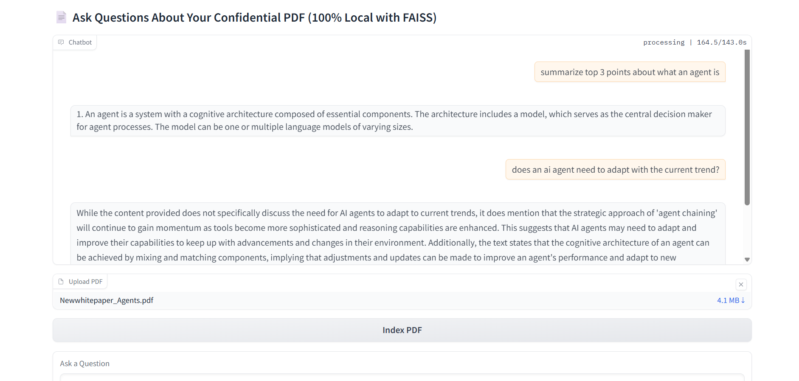
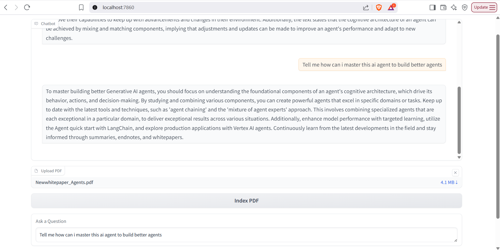

# 📄 Local LLM PDF Reader with FAISS + Gradio

A privacy-first, fully local AI application that lets you ask questions about your **confidential PDF documents** using **local language models**, **FAISS vector search**, and a **Gradio chatbot UI**.

---

## 🚀 Project Overview

This project demonstrates how to build a Retrieval-Augmented Generation (RAG)-style PDF assistant using:

- 🧠 A **local LLM** (via `llama-cpp`)
- 🔍 **FAISS** for fast semantic similarity search
- 💡 **SentenceTransformer** for text embeddings
- 📄 **PyMuPDF (`fitz`)** for extracting text from PDFs
- 🧰 A clean **Gradio** interface for interaction

This solution runs **100% locally** (no OpenAI or external API), making it ideal for private or air-gapped environments.

---

## 🧩 Features

- 📥 Upload any PDF file
- 🧠 Automatically chunk and vectorize its content
- 🔎 Ask natural language questions
- 🤖 Receive LLM-generated answers based only on the PDF content
- 🔐 Works fully offline – privacy preserved
- 🖥️ Designed for local development and personal use

---

## 📦 Tech Stack

| Component              | Technology           |
|------------------------|----------------------|
| Local LLM Inference    | `llama-cpp-python`   |
| Embeddings             | `sentence-transformers` (MiniLM) |
| Vector DB              | `FAISS`              |
| PDF Parsing            | `PyMuPDF` (`fitz`)   |
| Frontend UI            | `Gradio`             |
| Environment            | Python 3.8+ & WSL/Ubuntu |

---

## 🖼️ UI Preview

### 🔹 Screenshot 1


### 🔹 Screenshot 2


---

## 🛠️ How It Works

1. **PDF Parsing**  
   The PDF is opened using `PyMuPDF`, and its text is extracted page-wise. If the PDF is image-based, you’ll need OCR support (future enhancement).

2. **Chunking**  
   The raw text is split into manageable chunks (e.g., 500 characters).

3. **Embedding & Indexing**  
   Each chunk is embedded using a pre-trained SentenceTransformer and indexed in FAISS.

4. **Semantic Search + RAG**  
   When a user asks a question:
   - We embed the query
   - Retrieve top similar chunks using FAISS
   - Construct a prompt containing relevant context
   - Feed to the local LLM for answer generation

---

## 📂 Folder Structure

pdfReaderLLM/
├── models/ # Place your .gguf LLM file here
├── screenshots/ # UI demo images for README
├── app.py # Main Gradio + LLM code
├── venv/ # Python virtual environment (gitignored)
├── requirements.txt # All Python dependencies
└── README.md # This file


---

## ▶️ Running the App

### 1. Create Virtual Environment

```bash
python3 -m venv venv
source venv/bin/activate
```

### 2. Install Dependencies
```bash
pip install -r requirements.txt
```
Make sure you have your .gguf model downloaded in the models/ folder.

### 3. Run the app
```bash
python app.py
```

---
## 📌 Limitations

- Doesn’t support image-only PDFs *(OCR support planned)*
- Requires a compatible `.gguf` model (e.g., LLaMA, Mistral, etc.)
- Not production-optimized; built for learning and personal research

---
## 📚 Sample Use Cases

- Reading & querying long technical PDFs  
- Summarizing legal documents  
- Creating privacy-safe AI assistants for documents

---

## 🧑‍💻 Author

**Usama Mohammed**  
Built for privacy-first AI exploration with local LLMs.

---

## 🛡️ License

**MIT License** – use freely, modify safely.

---

## ⭐️ Star the Repo

If this helped or inspired you, consider giving it a ⭐️ on GitHub!


